# MIA IAC AGW Glean (Enterprise Data Nervous System)

## Project Overview
**MIA IAC AGW Glean** is a production-grade, Zero-Trust Architecture Proof of Concept (POC) designed to build an event-driven **Enterprise Data Nervous System**.

The platform safely orchestrates the ingestion, stream-transformation, AI enrichment, and cryptographic routing of highly fragmented corporate data. It dynamically processes mutations across multiple SaaS ecosystems (**Google Workspace, Slack, Microsoft Teams, and Salesforce**) and feeds them down to specialized search engines (**Glean, Coveo, and Algolia**) based on operational requirements, while guaranteeing absolute data separation and zero content leakage.

---

## Technical Architecture & Flow

The system operates on an asymmetric, event-driven streaming model powered by **Confluent Cloud** and **Apache Flink**. All transport vectors utilize **mTLS (Mutual TLS)** with **TLSv1.3** to guarantee end-to-end transport encryption. Identity boundaries are tied directly into **Azure AD (Entra ID)** group descriptors.

```mermaid
graph TD
    %% --- Sources Layer ---
    subgraph Sources [ polymorphic Enterprise Silos ]
        GW[Google Workspace]
        SL[Slack Enterprise]
        MT[Microsoft Teams]
        SF[Salesforce CRM]
    end

    %% --- Backbone Layer ---
    subgraph Backbone [ Confluent Cloud Transport Layer ]
        direction TB
        CC_SR[Schema Registry]
        K_GW[Topic: workspace-mutations]
        K_SL[Topic: slack-mutations]
        K_SF[Topic: salesforce-cdc]
    end

    %% --- Processing Layer ---
    subgraph Processing [ Stream Processing & AI Enrichment ]
        direction TB
        FLINK[Apache Flink Stream Engine]
        V_AI[(Vertex AI Platform)]
        AAD[Azure AD / Entra ID]
        UDF[Flink Async Ingestion UDF]
    end

    %% --- Sinks Layer ---
    subgraph Sinks [ Specialized Core Engines ]
        GLEAN[Glean Indexing API <br/> Workplace RAG & ACLs]
        COVEO[Coveo Index Sink <br/> Pipeline Workflows]
        ALGOLIA[Algolia Edge API <br/> Sub-10ms UI Performance]
    end

    %% --- Network Transport Constraints ---
    style Backbone fill:#112233,stroke:#33aaff,stroke-width:2px
    style Processing fill:#221133,stroke:#bb33ff,stroke-width:2px
    style Sinks fill:#113322,stroke:#33ffaa,stroke-width:2px

    %% --- Data Pipelines Flow ---
    GW -- HTTPS/Webhooks --> K_GW
    SL -- HTTPS/Webhooks --> K_SL
    MT -- HTTPS/Webhooks --> K_SL
    SF -- Pub/Sub API --> K_SF

    K_GW -- mTLS / TLS 1.3 --> FLINK
    K_SL -- mTLS / TLS 1.3 --> FLINK
    K_SF -- mTLS / TLS 1.3 --> FLINK
    CC_SR <--> |Schema Validation| FLINK

    FLINK --> |Async I/O Request| UDF
    UDF <--> |text-embedding-004| V_AI
    FLINK <--> |Graph API Identity Mapping| AAD

    FLINK -- Secure Push REST Sink --> GLEAN
    FLINK -- Bulk Push Sync --> COVEO
    FLINK -- Minimal Payload Route --> ALGOLIA

```


---
## Core Technical Matrix

| Pipeline Stage | Technology | Implementation Pattern | Focus Matrix |
| :--- | :--- | :--- | :--- |
| **Ingestion Engine** | Confluent Cloud | Fully Managed Apache Kafka + Avro Registries | High-throughput serialization, strict decoupling, and schema governance. |
| **Stream Processing** | Apache Flink | Flink SQL + Java Async I/O UDFs | Real-time payload normalization, transformations, and event-driven data flow. |
| **AI Augmentation** | Vertex AI | `text-embedding-004` & `gemini-1.5-flash` | Semantic vector generation ($768$/$1536$ dimensions) and automated content classification. |
| **Identity Control** | Azure AD (Entra ID) | SCIM & Graph API Synchronization | Mapping upstream enterprise permissions directly to Azure AD Group Object IDs. |
| **Network Security** | Custom Certificate Auth | Mutual TLS (mTLS) with TLS 1.3 | Bi-directional, cryptographic worker-to-broker handshake authentication. |
| **Workplace Search** | **Glean** | Indexing API Push Model | Identity-Aware Search, cross-app context graphs, and Federated Workplace RAG. |
| **Enterprise Operations** | Coveo | Structured Cloud Index Sync | Cross-silo business logic rules, index pipeline control, and Salesforce case routing. |
| **High-Performance UI** | Algolia | Edge REST Sink Payload | Light metadata indexing for sub-10ms operational type-ahead search latency. |


## Core Technical Matrix

The repository structure follows an isolation pattern to cleanly segregate business logic streams, multi-cloud declarative infrastructure configs, and zero-trust credentials:
```Text 
.
├── api/                          # Protocols and contract schemas (Protobuf/OpenAPI)
├── docs/                         # Runbooks, search relevance tuning, and NIST mapping
├── pkg/                          # Shared operational client wrappers (Algolia, Glean, Confluent)
├── security/                     # Identity schemas, Azure AD mappings, and mTLS stores
│   ├── iam/azure-ad-sync/        # SCIM structures mapping workspace attributes to Entra IDs
│   └── network/mtls-certs/       # Local development CA assets (Excluded from git)
├── services/                     # Microservice execution engines
│   ├── flink-stream-processor/   # Flink stream definitions and async model enrichment loops
│   └── search-ingest-agent/      # Go-based webhooks managing ingest rate-limiting backpressure
└── terraform/                    # High-elasticity IAC infrastructure maps
```
---

## Security Compliance & Identity Verification (NIST 800-53)

This implementation is architected to strictly satisfy **NIST-800-53-REV5** Access Controls (AC) and System and Communications Protection (SC) families through an ironclad, data-centric **Principle of Least Privilege** pattern:

1. **The "Zero Document Leakage" Constraint (AC-3, AC-6):** Enterprise data is never stored or processed on the streaming backbone with broad or inherited read-permissions. The ingestion pipelines normalize polymorphic source permissions from Slack, Teams, and Salesforce, explicitly appending an immutable array of mapped `azure_ad_permitted_groups` to the metadata envelope of every document entity before it reaches a search index sink.

2. **Query-Time Identity Intersection (AC-4, IA-2):** When an enterprise user executes a conversational RAG request or search query via Glean, the frontend application intercepts and passes the user's active, cryptographically signed Azure AD JSON Web Token (JWT). The system validates the token claims and instantly intersects the user's verified Group Object IDs with the document's `allowed_groups` array. This access check occurs at the datastore layer *before* the semantic ranking algorithms or generative LLMs parse context, ensuring unauthorized document titles or summary snippets are mathematically eliminated from the response payload.

3. **mTLS Wire Security & Transport Isolation (SC-7, SC-8, SC-13):** All cluster-internal communication boundaries mandate valid X.509 certificates validated by an internal Enterprise Certificate Authority. Anonymous or unencrypted data vectors over the TCP layer are programmatically blocked by transport endpoints. The network restricts traffic exclusively to **TLSv1.3**, leveraging modern ephemeral key exchange cipher suites (e.g., `TLS_AES_256_GCM_SHA384`) to enforce bi-directional worker-to-broker authentication and guarantee perfect forward secrecy.

4. **Cryptographic Key Segregation (SC-28):**
   Sensitive local secrets, environment identifiers, and connection strings are strictly segregated out of the application code using encrypted configurations (`.env`) wrapped by automated secret rotation policies. Local development keystores (`.jks`, `.p12`) are explicitly blocked at the repository boundary via the workspace `.gitignore` shield to prevent credential exposure.

---
## Getting Started: Local Verification Deployment

Follow this sequence to spin up the local development environment, establish the secure cryptographic transport boundaries, and verify the conformed pipeline ingestion.

### 1. Prerequisite Environment Staging
Ensure your local configurations are fully populated and your local keystores are properly staged outside of version control.

```bash
# 1. Verify your secret shield is properly populated

./scripts/ci-cd/deploy-local-pipeline.sh --env=dev

cat .env

# 2. Ensure your local mTLS Keystores and Truststores are in place
ls -l security/network/mtls-certs/client/kafka.client.keystore.jks
ls -l security/network/mtls-certs/ca/kafka.client.truststore.jks
```

### 2. Initializing Local Mock Infrastructure
   Before deploying the Flink stream processor, spin up local multi-source mock containers (Slack, Salesforce, and Google Workspace webhook emulators) alongside a local secure Kafka broker to mimic the Confluent Cloud environment.
```bash

# Navigate to your scripting directory
cd scripts/ci-cd/

# Grant execution permissions to the setup utilities
chmod +x launch-local-infra.sh deploy-local-pipeline.sh

# Spin up local docker-compose dependencies with TLS 1.3 enforced
./launch-local-infra.sh --config=secure-dev
```

### 3. Deploying the Flink Stream Processor Pipeline
   Once the underlying message brokers and identity-mapping endpoints are responsive, compile and submit your Java/Scala asynchronous UDF pipeline to the local Flink job manager.
   
```bash
# Execute the build and submission script
./deploy-local-pipeline.sh --env=dev --enable-mtls=true --target=all-sinks

```

This command automatically executes the following orchestration steps:

* **Schema Validation & Registry Binding:** Pulls and validates the conformed Avro schemas for Slack, MS Teams, and Salesforce against the central Confluent Schema Registry to ensure zero data payload drift.
* **Shadow JAR Compilation:** Packages the core Flink processing stream, Java dependencies, and transformation logic into a highly optimized, deployment-ready shadow JAR executable (`target/flink-stream-processor-1.0-SNAPSHOT.jar`).
* **Cluster Submission & Graph Initialization:** Submits the compiled execution graph to the Flink JobManager, spinning up the distributed task slots with active mTLS handshake configurations.
* **Async I/O Worker Pooling:** Boots up the non-blocking, asynchronous worker thread pools within Flink to handle high-throughput external API calls directly to **Vertex AI** (`text-embedding-004`) without bottlenecking the stream.
* **Identity Mapping Sync:** Establishes the real-time identity translation layer, cross-referencing incoming application metadata with **Azure AD Group Object IDs**.
* **Multi-Engine Sink Dispatch:** Initializes the downstream secure push networks, multi-casting the finalized, vector-enriched, and ACL-bound records simultaneously to the **Glean**, **Coveo**, and **Algolia** endpoints.


### 4. Verification & Stream Inspection
   To verify that polymorphic events are being conformed, enriched, and securely tagged with Azure AD Group Object IDs in real time, tail the local ingestion log output:
   
```bash
# Monitor the conformed data output stream
tail -f ../../data/output/glean_secure_ingest.log

```